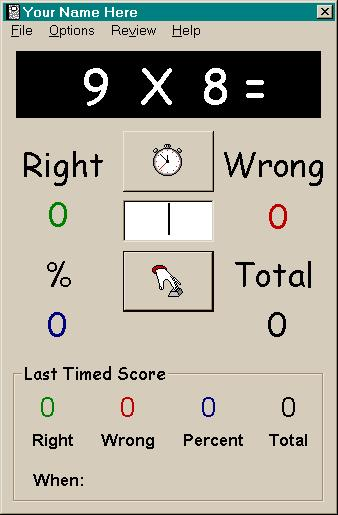



## Matt's Multiplier

### Description

My son was having problems with his multiplication tables, so I wrote this using what was available in the VB 6 Pro version. He enjoys it and is learning! This application drills multiplication tables. The user can practice and then take timed tests. Wrong answers and problems are saved to be retried. Last score and high score are displayed. User can pick individual tables.

Code Examples for:

GetSetting()

SaveSetting()

Timer()

ReDim

Show Helpfile Index from Menu

Show Initial Splash that can be turned off

I know this is not rocket science, but I enjoyed writing the code and learning as I did.
 
### More Info
 

             |
---                |---
**Submitted On**   |2003-07-19 14:33:54
**By**             |[Paul D](https://github.com/Planet-Source-Code/PSCIndex/blob/master/ByAuthor/paul-d.md)
**Level**          |Intermediate
**User Rating**    |4.7 (14 globes from 3 users)
**Compatibility**  |VB 6\.0
**Category**       |[Complete Applications](https://github.com/Planet-Source-Code/PSCIndex/blob/master/ByCategory/complete-applications__1-27.md)
**World**          |[Visual Basic](https://github.com/Planet-Source-Code/PSCIndex/blob/master/ByWorld/visual-basic.md)
**Archive File**   |[Matt's\_Mul1617467192003\.zip](https://github.com/Planet-Source-Code/paul-d-matt-s-multiplier__1-47030/archive/master.zip)

